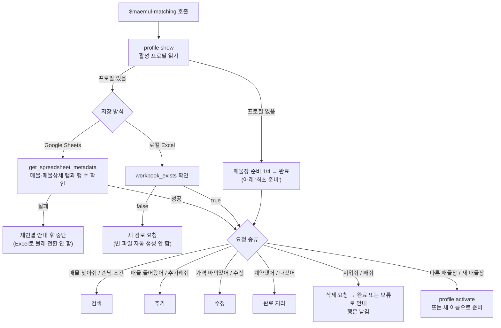
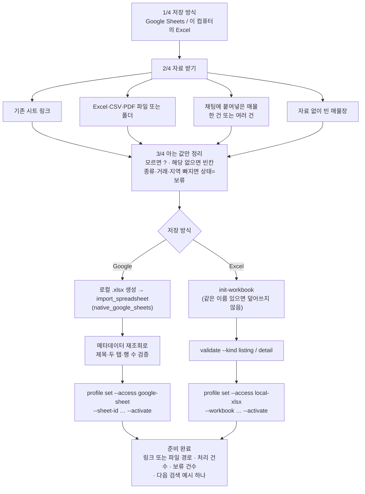
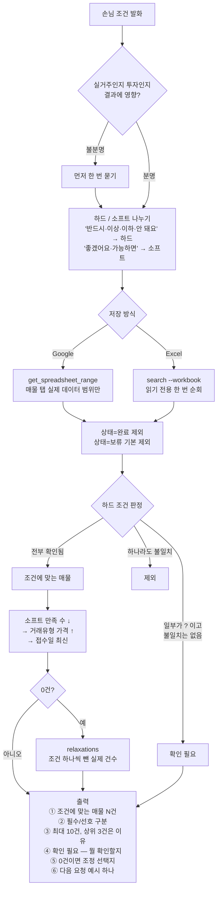
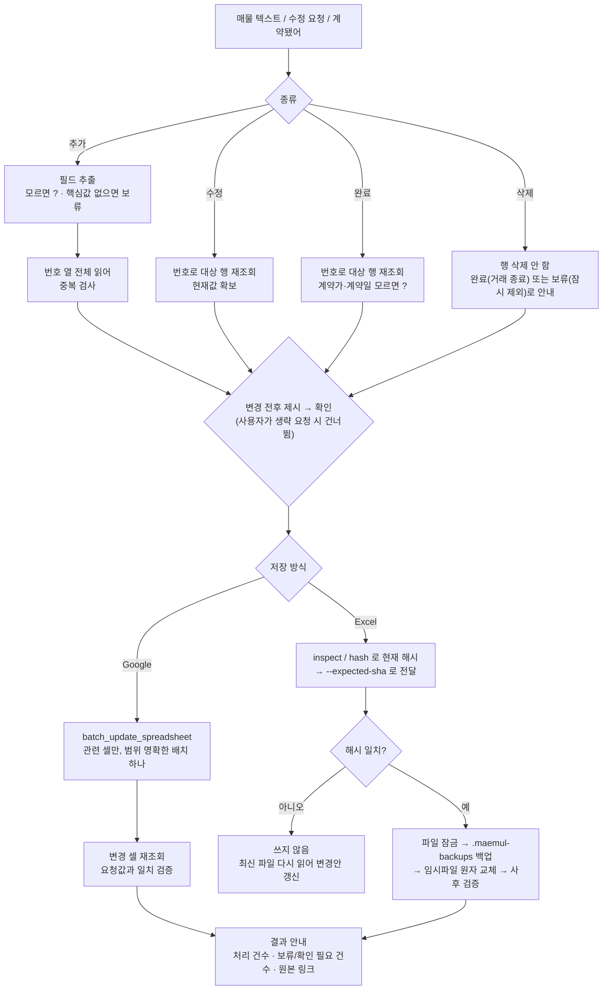

# maemul-matching

공인중개사의 매물장을 **Google Sheets** 또는 **로컬 Excel(.xlsx)** 하나로 운영하면서,
손님 상담 조건을 그대로 말해서 매물을 찾고 등록·수정·계약완료까지 처리하는 Codex skill입니다.

```text
나: 구로구 아파트 전세, 예산 3억 이하, 강아지 키워도 되는 곳 찾아줘

Codex: 조건에 맞는 매물은 3건입니다. (확인 필요 2건)
       필수 — 구로구 / 아파트 / 전세 / 보증금 30,000만원 이하
       선호 — 반려동물 가능

       1. P002 신도림동 교육용B단지 59.8㎡ 전세 28,000
          → 지역·종류·거래·예산 모두 충족, 반려 N (선호 미충족)
       ...
       확인 필요 — P007은 반려 항목이 '?'입니다. 집주인 확인이 필요합니다.
```

## 왜 이 스킬이 필요한가

중개사의 매물장은 원래 불완전합니다. 카톡으로 온 매물은 층만 있고 향이 없고, 반려동물 가능
여부는 집주인에게 물어봐야 알 수 있습니다. 일반적인 도구는 이런 자료를 "입력 오류"로 거부하거나,
반대로 빈칸을 조용히 채워 넣어 **확인되지 않은 매물을 손님에게 추천**하는 사고를 냅니다.

이 스킬은 그 중간을 다룹니다.

- **모르는 값은 `?`로 남긴다** — 지우지도, 추측해서 채우지도 않습니다.
- **`?`는 절대 "일치"로 세지 않는다** — 별도의 `확인 필요` 후보로 분리합니다.
- **핵심값이 없어도 저장은 된다** — `종류·거래·지역` 중 하나라도 없으면 `상태=보류`로 기록하고,
  기본 검색에서만 빼둡니다. "저장 실패"가 아니라 "저장됨, 확인 필요"입니다.

## 전체 흐름

스킬이 호출되면 **매번** 이 순서로 시작합니다. 매물장이 없으면 준비로, 있으면 연결을 확인한 뒤 요청을 처리합니다.



연결 확인이 "매번 먼저"인 이유: 프로필 파일에는 시트 ID가 적혀 있을 뿐이고, 시트가 지워졌는지·권한이 끊겼는지는
실제로 열어봐야 알 수 있습니다. Google은 `get_spreadsheet_metadata` 한 번, Excel은 파일 존재 여부 한 번으로 끝납니다.

## 최초 준비 (매물장이 없을 때)

활성 프로필이 없을 때, 그리고 사용자가 새 매물장을 원할 때만 이 4단계를 밟습니다. 한 번 준비되면 다시 묻지 않습니다.



- 원본 파일은 수정하지 않습니다. 변환 결과는 새 시트 또는 새 `.xlsx`에 만듭니다.
- 사용자가 링크나 매물 텍스트만 던져도 직전 질문의 답으로 받아 진행합니다.
- 시트 ID 자리에 링크 전체를 넣어도 ID를 뽑아 저장하고, ID와 링크가 다른 시트를 가리키면 저장을 거부합니다.

## 검색

"손님이 ~한 거 찾는대", "구로구 84 이상 3억 5천 이하 남향이면 좋겠고" 같은 말이 들어오면 이 순서로 답합니다.
검색은 읽기 전용이라 확인 없이 바로 실행합니다.



- `?`가 있는 후보는 "가능 매물"이 아니라 "집주인 확인이 필요한 후보"입니다. 손님용 추천문에 바로 넣지 않습니다.
- `relaxations`는 하드 조건을 **하나만** 뺀 실제 건수입니다. 두 조건을 함께 완화한 건수는 재검색 전에는 말하지 않습니다.
- 개인정보(소유자·연락처)는 `매물상세` 탭에만 있어서 검색 결과에 나오지 않습니다.

## 추가 · 수정 · 완료

쓰기는 전부 **대상 재조회 → 변경 전후 제시 → 확인 → 쓰기 → 재조회 검증** 골격입니다.
"그냥 바로 추가해줘"는 **확인** 단계를 건너뛰는 것이지, 번호 중복 검사와 재조회 검증은 건너뛰지 않습니다.



| 저장 방식 | 덮어쓰기 방지 | 되돌리기 |
| --- | --- | --- |
| Google Sheets | 쓰기 직전 라이브 재조회, 번호 중복 시 중단 | Google Sheets 자체 버전 기록 |
| 로컬 Excel | `--expected-sha` 해시 비교 — 확인 후 파일이 바뀌면 중단 | `.maemul-backups/` 자동 백업 |

완료 처리는 행을 지우지 않고 `상태=완료`로 바꿉니다. 나중에 "그 단지 얼마에 나갔지?"를 찾을 수 있습니다.

## Codex에서 실제로 돌아가는 방식

| 역할 | 담당 |
| --- | --- |
| 자연어 → 하드/소프트 조건, 필드 추출, 안내 문구 | Codex 모델 (`SKILL.md` + `references/`) |
| Google 시트 읽기·쓰기 | Codex 앱 연결 도구 `google_drive.*` — `get_spreadsheet_metadata`, `get_spreadsheet_range`, `batch_update_spreadsheet`, `import_spreadsheet` 등 |
| 프로필 저장, 로컬 Excel 검색·쓰기·해시·백업 | `scripts/maemul_tool.py` (Python, 결정적) |

`SKILL.md`는 요청 종류에 따라 필요한 참고 문서만 읽게 라우팅합니다 — 검색이면 `matching-rules.md`,
변경이면 저장 방식 문서의 변경 절만. 매물이 수천 건이어도 원본 행 전체를 대화에 싣지 않습니다.

## 설계 원칙 (이 스킬이 하지 않는 것)

- **SQLite·별도 DB를 만들지 않습니다.** 중개사가 직접 열어보고 수정할 수 있는 시트/엑셀이 원본입니다.
- **행을 삭제하지 않습니다.** 계약된 매물은 `상태=완료`로 남습니다.
- **CSV를 저장 방식으로 제시하지 않습니다.** 표준 CSV는 읽기 전용 스냅샷·템플릿 용도입니다.
- **연결 실패를 우회하지 않습니다.** Google 인증이 실패했다고 몰래 로컬로 갈아타지 않습니다.
- **개인정보를 검색용 탭에 두지 않습니다.** 소유자·연락처는 `매물상세` 탭에만 있습니다.
- **법정 서식을 대체하지 않습니다.** 매칭용 축약 데이터이며, 중개대상물 확인·설명서는 별도입니다.

## 매물장 구조

두 개의 탭으로 나뉩니다. **검색에 쓰는 값**과 **후보를 좁힌 뒤 확인할 값**을 분리한 구조입니다.

**`매물` 탭 (28열)** — 번호·상태·종류·거래 / 지역·동네·단지명·동호 /
매매가·보증금·월세·관리비(만원) / 전용㎡·방수·욕실·층·총층·향·준공 /
주차·반려·옵션·입주가능 / 인근역·역도보(분)·초등학교·초등도보(분) / 접수일

**`매물상세` 탭 (20열)** — 번호로 연결. 소유자·연락처, 권리관계·임대차현황, 용도지역·건폐율·위반건축물,
시설·옵션·학군 상세, 공시가격·취득조세, 특약·메모, 계약일·실제계약금액

값 규칙: 가격은 만원 단위 정수(`3억 5천` → `35000`), 모르면 `?`, 거래유형상 해당 없으면 빈칸.

컬럼의 출처는 두 갈래입니다. `매물상세`는 공인중개사법 시행규칙 [별지 제20호서식] 중개대상물 확인·설명서Ⅰ의
항목을, `매물`은 호갱노노·직방·다방이 실제로 제공하는 검색 필터를 근거로 했습니다. 반려동물·방 개수·주차 대수처럼
법정 서식에 없는 항목이 `?`와 `확인 필요`가 존재하는 이유입니다.

`assets/`의 템플릿 CSV는 이 28열·20열의 정본이고, 도구 상수와 일치하는지 테스트로 고정돼 있습니다.
`매물장-샘플.csv`는 진행·보류·완료가 섞인 가상 데이터 5건으로, 시연과 실습에 그대로 쓸 수 있습니다.

## 설치

```bash
git clone https://github.com/jongwoo01/maemul-matching.git ~/.codex/skills/maemul-matching
```

이미 같은 경로에 설치돼 있다면 clone으로 덮어쓰지 말고 `git pull`로 갱신하세요.

로컬 Excel을 쓰려면 `openpyxl`이 필요합니다. Google Sheets만 쓴다면 필요 없습니다.

```bash
python3 -m pip install openpyxl
```

## 사용

```text
$maemul-matching으로 손님 조건에 맞는 매물을 찾아줘.
```

최초 1회만 저장 방식(Google Sheets / 로컬 Excel)을 고릅니다. 그 뒤로는 다시 묻지 않습니다.
Google Sheets를 쓰려면 Codex 앱에 Google Drive가 연결돼 있어야 합니다.

이렇게 말해도 다 알아듣습니다.

- `이 폴더에 매물장 만들어줘` / 시트 링크만 붙여넣기
- `구로구 84㎡ 이상 매매 3억 5천 이하 남향이면 좋겠고`
- `빌라, 월세, 마포구, 보증금 2천에 월세 30, 반려 N, 입주 협의. 추가해줘`
- `P002 보증금 4억 8천으로 수정` / `P001 계약됐어`
- `다른 매물장으로 바꿔줘` / `새 매물장 만들래` (기존 매물장은 그대로 남습니다)

프로필은 `$CODEX_HOME/maemul-matching/profiles.json`(없으면 `~/.codex/…`)에 저장되며, 저장소 밖입니다.

## 도구 직접 호출

모든 명령은 JSON을 출력하고 실패 시 0이 아닌 코드를 반환합니다.

```bash
tool=~/.codex/skills/maemul-matching/scripts/maemul_tool.py

python3 $tool profile show
python3 $tool init-workbook --workbook /절대경로/매물장.xlsx
python3 $tool validate     --workbook /절대경로/매물장.xlsx --kind listing
python3 $tool hash         --file /절대경로/매물장.xlsx
python3 $tool inspect      --workbook /절대경로/매물장.xlsx --id P001

python3 $tool search --workbook /절대경로/매물장.xlsx --limit 10 --criteria-json '{
  "hard": [
    {"field": "지역", "op": "contains", "value": "구로구"},
    {"field": "거래", "op": "eq",       "value": "전세"},
    {"field": "보증금(만원)", "op": "lte", "value": 30000}
  ],
  "soft": [
    {"field": "반려", "op": "eq", "value": "Y"}
  ]
}'

python3 $tool update --workbook /절대경로/매물장.xlsx --id P001 \
  --changes-json '{"보증금(만원)":"48000"}' --expected-sha <sha>
```

지원 연산자: `eq` `ne` `in` `not-in` `contains` `lte` `gte` `between`.
전체 명령(`add` 일괄 추가, `complete`, `detail-upsert`, 프로필 관리)은
[references/tool-usage.md](references/tool-usage.md)를 보세요.

### search 출력

```jsonc
{
  "matches": [...],              // 하드 조건이 전부 확인된 매물
  "needs_verification": [...],   // 하드 조건 값이 '?'라 단정할 수 없는 후보
  "relaxations": [...]           // 하드 조건을 하나씩 뺐을 때의 실제 건수
}
```

## 테스트

외부 연결 없이 실행됩니다.

```bash
python3 -m unittest discover -s tests -p 'test_*.py'
```

- `test_maemul_tool.py` — 시트 ID 검증, 프로필 전환·보존, Excel 추가·검색·수정·완료·해시 충돌, 템플릿과 스키마 일치
- `test_ux_contract.py` — 문서 자체를 검사합니다. 매 요청 연결 확인, 확인 생략 시에도 중복 검사·재조회 유지,
  행 삭제 금지, 제거된 명령이 문서에 남아 있지 않은지 등 **문서가 규칙을 잃지 않았는지**를 고정합니다.

## 디렉터리

```text
SKILL.md                            Codex 진입점 — 연결 확인·라우팅·안전 규칙
agents/openai.yaml                  표시 이름과 기본 프롬프트
references/setup.md                 저장 방식 선택과 4단계 준비, 매물장 전환
references/google-sheets-workflow.md  Google 읽기·쓰기·실패 처리
references/excel-workflow.md        폴더 기반 Excel 읽기·쓰기·대용량 원칙
references/matching-rules.md        하드/소프트 판단, ? 처리, 순위, 0건 대응
references/sheet-schema.md          두 탭의 컬럼 정의와 값 규칙
references/tool-usage.md            CLI 전체 명령
references/user-experience.md       안내·오류 복구 문구
scripts/maemul_tool.py              프로필, 결정적 검색, 안전한 로컬 변경
tests/                              도구 회귀 + 문서 계약 테스트
assets/                             매물장 템플릿 CSV(정본)와 샘플
```

## 범위 밖

시세 산정, 광고 문구 작성, 계약서 작성, 법령·세금 해석은 이 스킬이 다루지 않습니다.
법정 사항은 국가법령정보센터의 현행 중개대상물 확인·설명서 서식을 직접 확인하세요.

개인 프로필과 인증 정보는 저장소 밖 Codex 설정에 보관되며 커밋되지 않습니다.
